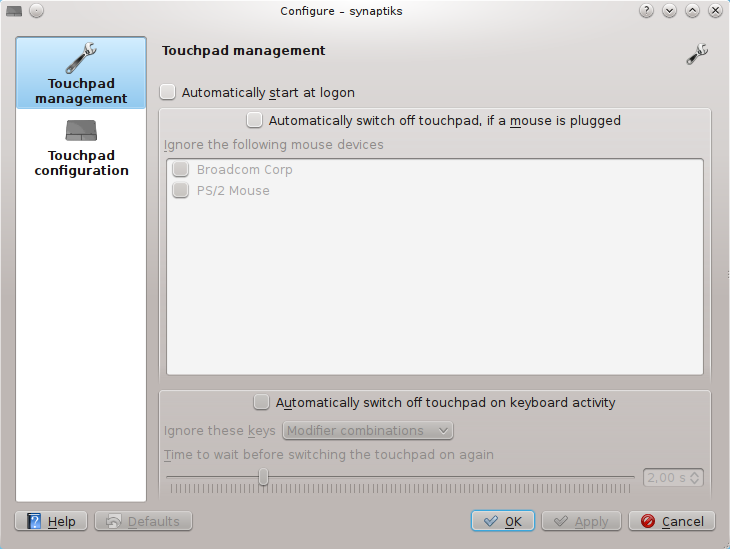

.. _introduction:

Introduction
============

|synaptiks| provides a |systemsettings| module for touchpad configuration and a
little touchpad management tool.

The |systemsettings| module configures the touchpad settings, including:

* Cursor motion speed settings
* Edge scrolling
* Two finger scrolling
* Circular scrolling (which allows you to scroll by moving your fingers in
  circles across the touchpad, much less tedious than edge scrolling in my
  opinion)
* Tapping settings (e.g. which mouse buttons are triggered by tapping into
  touchpad corners or with multiple touchpad)

It is located in |systemsettings| under :menuselection:`Input Devices -->
Touchpad`.

.. figure:: scrolling.png
   :align: center
   :scale: 50%

   Screenshot of scrolling configuration in the |synaptiks| |systemsettings|
   module

The touchpad management tool resides in the system tray and provides a global
hotkey to conceniently switch the touchpad on or off.  It can also do so
automatically while you are typing, or if you plug in an external mouse.  It is
available in the |kde| menu under :menuselection:`Applications --> Utilities
--> Touchpad management`.

.. figure:: traymenu.png
   :align: center
   :scale: 100 %

   Screenshot of the |synaptiks| tray application and its context menu

   Screenshot of the configuration dialog of the tray application

.. include:: ../substitutions.rst
