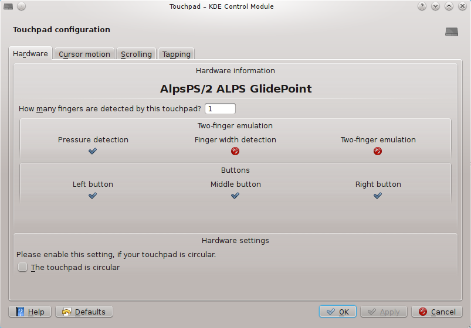
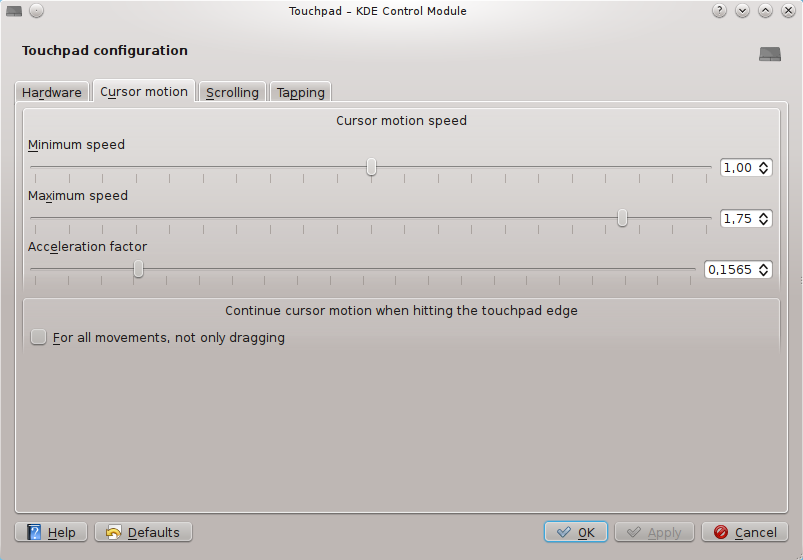
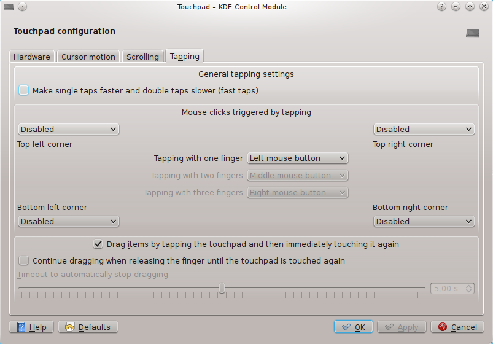

.. _commands:

Command reference
=================

.. _commands-touchpad-configuration:

Touchpad configuration
----------------------

The touchpad configuration module is available in |systemsettings| under
:menuselection:`Input Devices --> Touchpad`.

.. _commands-hardware-configuration:

:guilabel:`Hardware`
~~~~~~~~~~~~~~~~~~~~

   Screenshot of the :guilabel:`Hardware` page

:guilabel:`How many fingers are detected by this touchpad?`
   How many separate fingers the touchpad detects during tapping.

:guilabel:`Two-finger emulation`
   The state of two finger emulation support

:guilabel:`Pressure detection`
   The driver can detect the pressure of a touch

:guilabel:`Finger width detection`
   The driver can detect the width of the touched area

:guilabel:`Two-finger emulation`
   The driver supports two-finger emulation

:guilabel:`Buttons`
   The mouse buttons provided by the touchpad

.. _commands-motion-configuration:

:guilabel:`Cursor motion`
~~~~~~~~~~~~~~~~~~~~~~~~~

   Screenshot of the :guilabel:`Cursor motion` page

:guilabel:`Cursor motion speed`
   Configure cursor motion speed

   :guilabel:`Minimum speed`
      The scaling between touchpad coordinates and screen coordinates at slow
      movement

   :guilabel:`Maximum speed`
      The scaling between touchpad coordinates and screen coordinates at very
      fast finger movement

   :guilabel:`Acceleration factor`
      The acceleration between :guilabel:`Minimum speed` and :guilabel:`Maximum
      speed`

:guilabel:`Continue cursor motion when hitting the touchpad edge`
   Continue the cursor move while the finger stays in the touchpad edge

   :guilabel:`For all movements, not only dragging`
      Always continue cursor movement, when hitting the touchpad edge, not only
      when dragging

.. _commands-scrolling-configuration:

:guilabel:`Scrolling`
~~~~~~~~~~~~~~~~~~~~~

.. figure:: scrolling.png

   Screenshot of the scrolling configuration page

:guilabel:`Horizontal scrolling`
   Configure horizontal scrolling

   :guilabel:`Horizontal scrolling with two fingers`

      If checked, scrolling horizontally by dragging with two fingers is
      enabled.  If the touchpad does not support two-finger touches or
      two-finger emulation, this is disabled.

   :guilabel:`Horizontal scrolling at the bottom edge`
      If checked, horizontal scrolling at the bottom edge is enabled

   :guilabel:`Move distance to scroll a single line`
      The move distance of the finger to generate a horizontal scrolling event.
      The higher this value, the slower is horizontal scrolling.

:guilabel:`Vertical scrolling`
   Configure vertical scrolling

   :guilabel:`Vertical scrolling with two fingers`
      If checked, scrolling vertically by dragging with two fingers is enabled.
      If the touchpad does not support two-finger touches or two-finger
      emulation, this is disabled.

   :guilabel:`Vertical scrolling at the right edge`
      If checked, vertical scrolling at the right edge is enabled

   :guilabel:`Move distance to scroll a single line`
      The move distance of the finger to generate a vertical scrolling event.
      The higher this value, the slower is vertical scrolling.

:guilabel:`Continue edge scrolling automatically`
   If checked, edge scrolling will continue automatically:

   :guilabel:`Scrolling speed threshold to continue scrolling`
      The threshold of scrolling speed to automatically continue edge scrolling
      after lifting the finger from the touchpad (:dfn:`conventional
      coasting`).  If zero, :guilabel:`Continue edge scrolling automatically`
      is automatically disabled.

   :guilabel:`Continue edge scrolling, while the finger stays in an edge corner`
      If checked, continue edge scrolling not after lifting the finger from the
      touchpad, but while the finger stays in the corner (:dfn:`corner coasting`).

:guilabel:`Horizontal circular scrolling`
   Enable or disable circular scrolling

   :guilabel:`Area, which triggers circular scrolling`
      Configure the area, which triggers circular scrolling.  Each item
      represents a corner or an edge on the touchpad

   :guilabel:`Angle by which to move the finger to scroll a single line`
      Configure the angle, the finger needs to move on the touchpad in circular
      scrolling mode to scroll a single line.  The higher this value, the
      slower is circular scrolling.

.. _commands-tapping-configuration:

:guilabel:`Tapping`
~~~~~~~~~~~~~~~~~~~

   Screenshot of the tapping configuration page

:guilabel:`General tapping settings`

   :guilabel:`Make single taps faster and double taps slower (fast taps)`
      Enable or disable fast taps.  If fast taps are enabled, the driver will
      react faster on single taps, but slower on double clicks caused by double
      taps.

:guilabel:`Mouse clicks triggered by tapping`
    :guilabel:`Top left corner`
       Configure the mouse button, which is triggered by tapping the top left
       corner of the touchpad

    :guilabel:`Top right corner`
       Configure the mouse button, which is triggered by tapping the top right
       corner of the touchpad

    :guilabel:`Bottom left corner`
       Configure the mouse button, which is triggered by tapping the bottom
       left corner of the touchpad

    :guilabel:`Bottom right corner`
       Configure the mouse button, which is triggered by tapping the bottom
       right corner of the touchpad

    :guilabel:`Tapping with one finger`
       Configure the mouse button, which is triggered by tapping the touchpad
       with one finger

    :guilabel:`Tapping with two fingers`
       Configure the mouse button, which is triggered by tapping the touchpad
       with two fingers simultaneously.  Disabled, if the touchpad does not
       support two-finger taps or an emulation thereof

    :guilabel:`Tapping with three fingers`
      Configure the mouse button, which is triggered by tapping the touchpad
      with three fingers simultaneously.  Disabled, if the touchpad does not
      support three-finger taps

:guilabel:`Drag items by tapping the touchpad and then immediately touching it again`
   Enable or disable the tap-and-drag gesture, which enables dragging by
   tapping the touchpad and then immediately touching it again.

   :guilabel:`Continue dragging when releasing the finger until the touchpad is touched again`
      Continue a drag operation, if the finger is released from the touchpad,
      until the touchpad is tapped again.

   :guilabel:`Timeout to automatically stop dragging`
      Timeout, after which a drop operation automatically stops, after the
      finger was lifted from the touchpad.

.. _commands-management:

Touchpad management
-------------------

The touchpad management tool is available in the |kde| menu under
:menuselection:`Applications --> Utilities --> Touchpad management`.

.. _commands-tray-icon:

The tray icon
~~~~~~~~~~~~~

.. figure:: traymenu.png
   :align: center
   :scale: 100 %

   Screenshot of the |synaptiks| tray application and its menu.

When clicking the tray icon with the left mouse button, the configuration
dialog is shown (see :ref:`commands-management-configuration`).  When clicking
the tray icon with the right mouse button the context menu shown above pops up.

:guilabel:`Touchpad on`
   Switch the touchpad on or off.  If checked, the touchpad is on, otherwise it
   is off.  This action has the global hotkey :kbd:`Ctrl+Alt+T`.

:guilabel:`Configure Shortcuts`
   Show a dialog to configure the global shortcuts of |synaptiks|

:guilabel:`Configure synaptiks`
   Show the configuration dialog of the tray application (see
   :ref:`commands-management-configuration`)

:guilabel:`Help`
   Show the standard |kde| help menu

:guilabel:`Quit`
   Quit the tray application.

.. _commands-management-configuration:

The configuration dialog
~~~~~~~~~~~~~~~~~~~~~~~~

.. figure:: management.png
   :align: center
   :scale: 50 %

   Screenshot of the configuration dialog of the tray application

.. _commands-touchpad-management:

:guilabel:`Touchpad management`
+++++++++++++++++++++++++++++++

:guilabel:`Automatically start at logon`
   If checked, automatically start the tray application at logon.

:guilabel:`Automatically switch off touchpad, if a mouse is plugged`

   If checked, switch off the touchpad automatically, when a mouse is plugged

   :guilabel:`Ignore the following mouse devices`
      Mouses, checked in this list, are ignored.  If such a mouse is plugged or
      unplugged, the touchpad will *not* be switched.

:guilabel:`Automatically switch off touchpad on keyboard activity`
   If checked, switch off the touchpad automatically, while the keyboard is
   active

   :guilabel:`Ignore these keys`

      The selected kind of keys will be ignored when monitoring the touchpad

      :guilabel:`No keys`
         No keys are ignored

      :guilabel:`Modifier keys`
         Modifier keys (commonly :kbd:`Ctrl`, :kbd:`Shift` and :kbd:`Alt`) are
         ignored

      :guilabel:`Modifier combinations`

         Modifiers in combination with standard keys are ignored

   :guilabel:`Time to wait before switching the touchpad on again`
      The delay between the keyboard becoming inactive and switching the
      touchpad on again (in seconds)

:guilabel:`Touchpad configuration`
++++++++++++++++++++++++++++++++++

The touchpad configuration dialog, see :ref:`commands-touchpad-configuration`.

.. include:: /substitutions.rst
