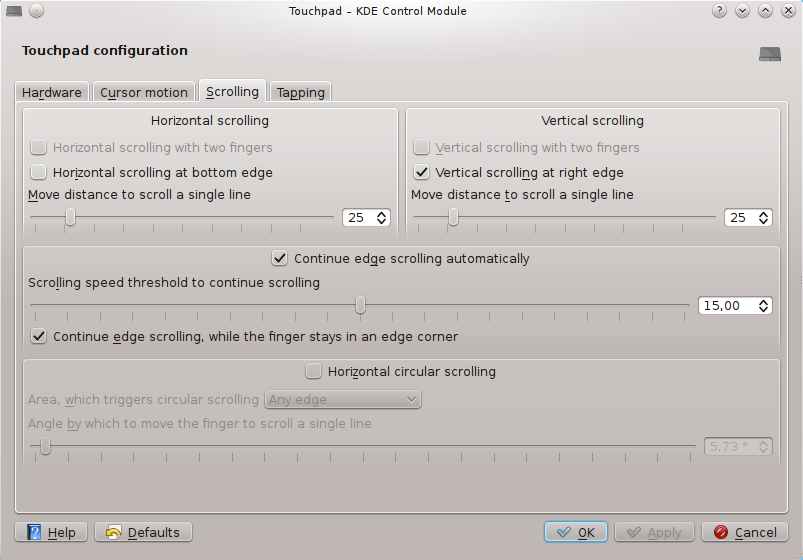
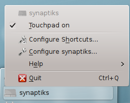

Welcome to synaptiks!
=====================

**synaptiks** is a touchpad configuration and management tool for KDE_,
available under the terms of the `simplified BSD licence`_ (see
:doc:`licence`).

Features
--------

**synaptiks** provides a System Settings module to configure both basic and
more advanced settings of the touchpad:

This includes:

- Cursor motion speed settings
- Edge scrolling
- Two finger scrolling
- Circular scrolling (which allows you to scroll by moving your fingers in
  circles across the touchpad, much less tedious than edge scrolling in my
  opinion)
- Tapping settings (e.g. which mouse buttons are triggered by tapping into
  touchpad corners or with multiple touchpad)

Additionally it comes with a little system tray application, which "manages"
the touchpad:

It does not only provide a global hotkey to conveniently switch the touchpad on
or off, it can also do this automatically while you are typing, or if you plug
in an external mouse.

The current release is **synaptiks** |release|:

- :doc:`list of important changes <changes>`
- `complete changelog`_
- :doc:`installation instructions <install>`

Documentation
-------------

Though most of the previously described features should be fairly easy to use,
**synaptiks** of course has a extensive Handbook_.  You should at last cast a
short look at the Usage_ chapter to make sure, that you know everything that
**synaptiks** can do for you.

For interested developers :doc:`API documentation <api/index>` is provided.
Read this, if you are want to develop **synaptiks** (see :ref:`contribution`
for more information on how to contribute to **synaptiks**), or if you are just
interested in the internals.

Issues and feedback
===================

If you like or dislike synaptiks or if you have any problems with synaptiks,
feel free to send an email with compliments or blame or with some questions.

If you have found a bug in synaptiks, if miss a certain feature or have any
proposals concerning synaptiks, please report them to the `issue tracker`_.
To help us with solving this issue, please include any information that you can
get into your report, including especially any error messages or tracebacks.
If unsure, better post more information than required.

.. _contribution:

Contribution and development
============================

All development of synaptiks happens on GitHub_.  The complete source code is
available in a git_ repository::

   git clone git://github.com/lunaryorn/synaptiks

If you want to create or update translations, or fix some issue in synaptiks,
or even add some new features, please fork this repository on GitHub_ and send
a pull requests with your work.  Of course, should you dislike GitHub, you can
also send patches through the issue tracker or through email.

.. _handbook: handbook/index.html
.. _usage: handbook/usage.html
.. _KDE: http://www.kde.org
.. _simplified BSD licence: http://www.opensource.org/licenses/bsd-license.php
.. _complete changelog: https://github.com/lunaryorn/synaptiks/commits/master
.. _issue tracker: https://github.com/lunaryorn/synaptiks/issues
.. _GitHub: https://github.com/lunaryorn/synaptiks
.. _git: http://git-scm.com/

.. toctree::
   :maxdepth: 2
   :hidden:

   install
   licence
   changes
   api/index
